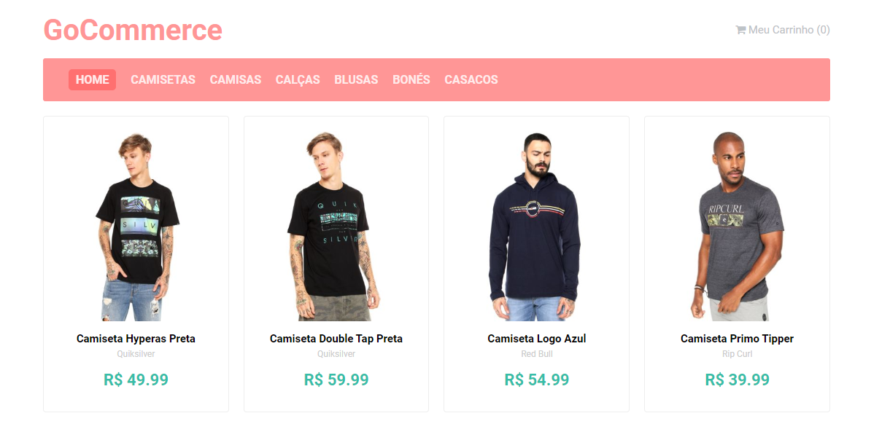
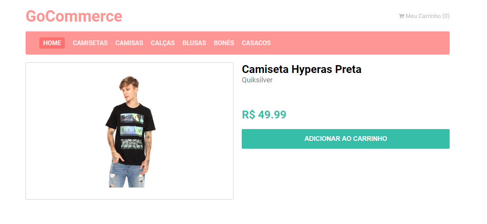
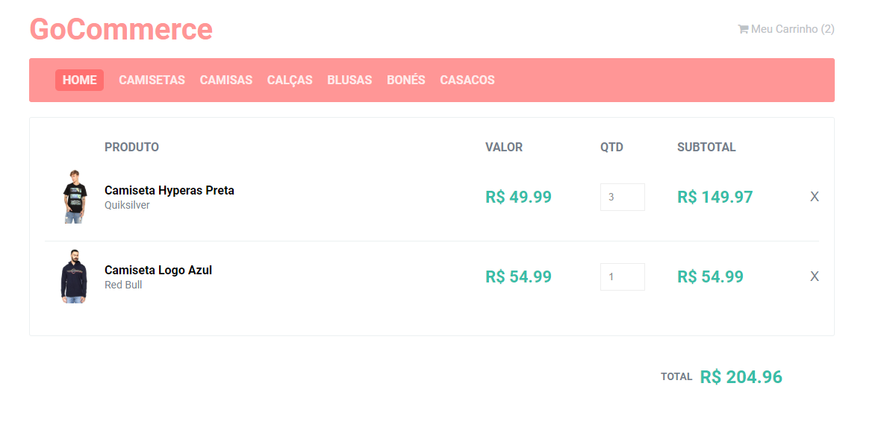

  <h3 align="center">4rd Rocketseat GoReact Challenge</h3>

---

## Overview

4rd challenge of the Rocketseat GoReact course.

## Preview

## Running the project

- Clone this repository
- Install all dependencies using the command `yarn`
- Fill the `.env` file
- Run `yarn start`
- Access `http://localhost:3000/`
- Run Json Server `json-server server.json -p 3001 -w -d 500`

## Used technologies

- React
- JSON-server
- Redux Saga
- Styled Component
- Other React JS libs
